# AWS CloudTrail Threat Detection Pipeline

A serverless AWS security pipeline that automatically detects and alerts on suspicious IAM and CloudTrail activity in real time, with full audit logging and MITRE ATT&CK mapping.

---

## Architecture

```
CloudTrail (Multi-Region)
      |
      v
S3 Bucket (Log Storage)
      |
      v (S3 Event Notification)
AWS Lambda (Python 3.12)
      |
      +----> SNS Topic --> Email Alert
      |
      +----> DynamoDB (Alert Audit Log)
      |
      +----> CloudWatch Logs (Execution Logs)
```

---

## Services Used

| Service | Purpose |
|---|---|
| AWS CloudTrail | Captures all management API events across all regions |
| Amazon S3 | Stores compressed CloudTrail log files |
| AWS Lambda | Parses logs and runs detection rules |
| Amazon SNS | Sends real-time email alerts on detections |
| Amazon DynamoDB | Persists every alert as an audit log record |
| AWS IAM | Least-privilege execution role for Lambda |
| Amazon CloudWatch | Stores Lambda execution and detection logs |

---

## Detection Rules

Each detection rule is mapped to a MITRE ATT&CK tactic and assigned a severity level.

| Event Name | Severity | MITRE ATT&CK Tactic | Technique |
|---|---|---|---|
| DeleteTrail | CRITICAL | Defense Evasion | T1562.001 - Impair Defenses |
| StopLogging | CRITICAL | Defense Evasion | T1562.001 - Impair Defenses |
| UpdateTrail | HIGH | Defense Evasion | T1562.001 - Impair Defenses |
| CreateUser | HIGH | Persistence | T1136.003 - Create Cloud Account |
| AttachUserPolicy | HIGH | Privilege Escalation | T1098 - Account Manipulation |
| PutUserPolicy | HIGH | Privilege Escalation | T1098 - Account Manipulation |
| CreateAccessKey | HIGH | Credential Access | T1528 - Steal Application Access Token |
| DeleteBucketPolicy | HIGH | Defense Evasion | T1070 - Indicator Removal |
| PutBucketAcl | MEDIUM | Exfiltration | T1530 - Data from Cloud Storage |
| AssumeRoleWithWebIdentity | MEDIUM | Privilege Escalation | T1548 - Abuse Elevation Control |
| ConsoleLogin | LOW | Initial Access | T1078 - Valid Accounts |

---

## Screenshots

### 1. CloudTrail Trail Active
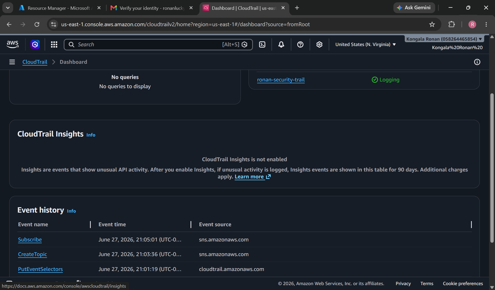

### 2. S3 Buckets Created
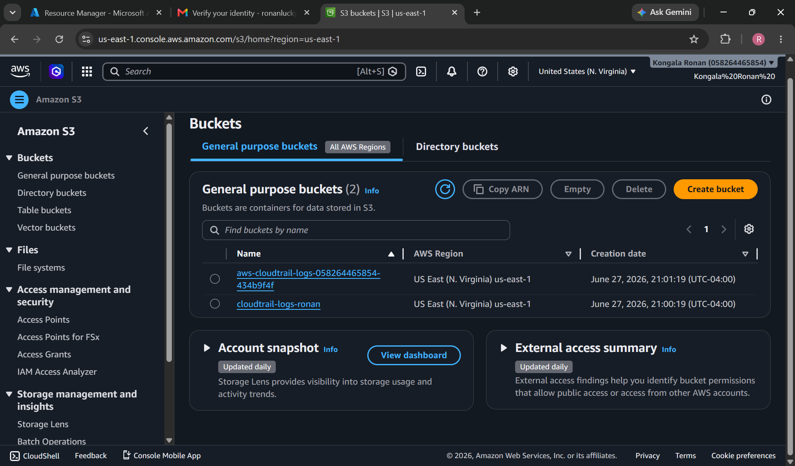

### 3. SNS Subscription Confirmed
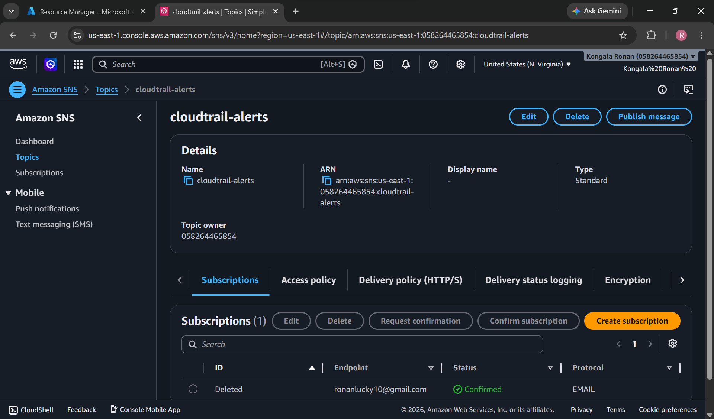

### 4. IAM Role Created
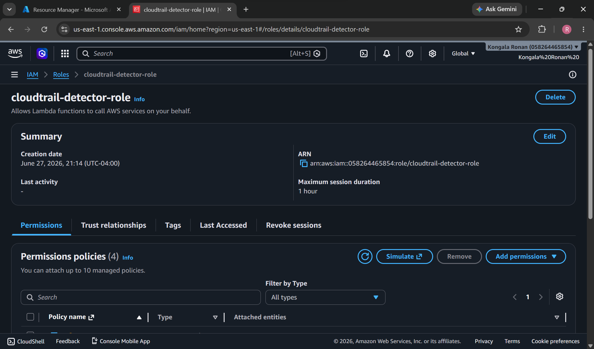

### 5. DynamoDB Table Created
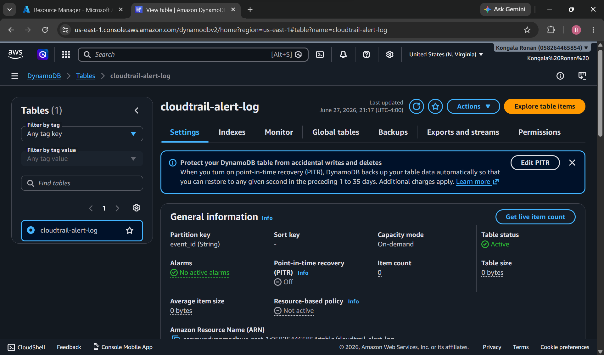

### 6. Lambda Function Created
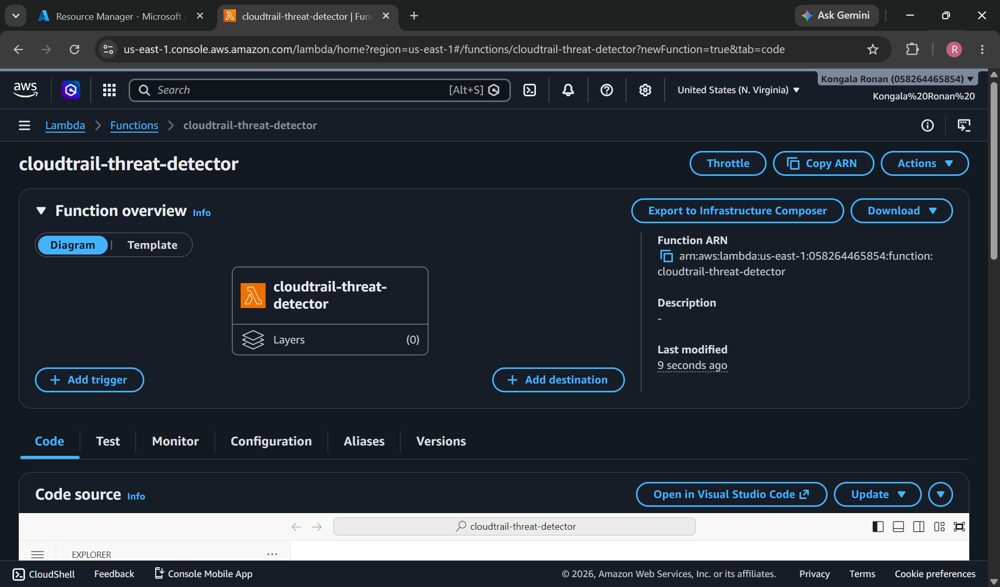

### 7. Lambda S3 Trigger Connected
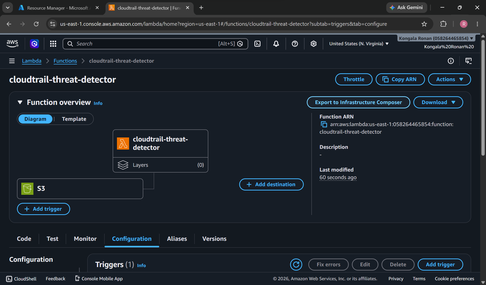

### 8. Alert Email Received
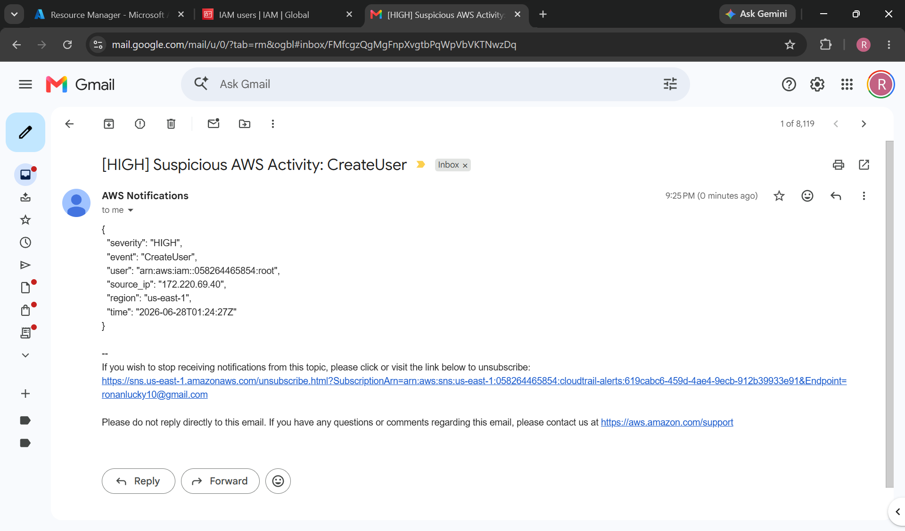

### 9. DynamoDB Alert Logged
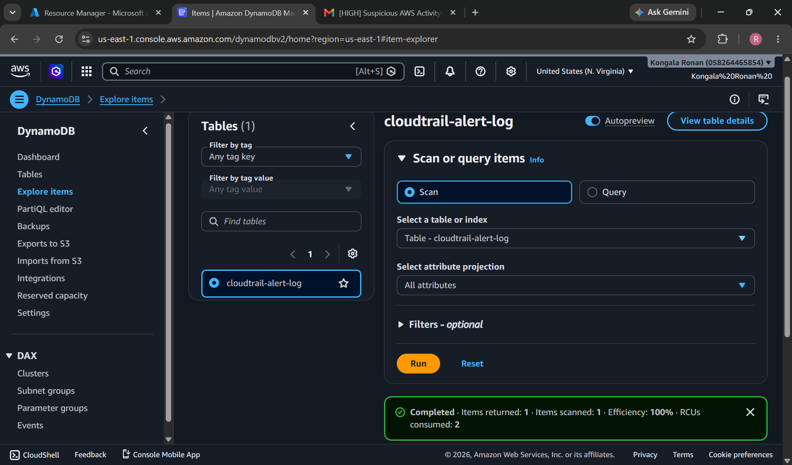

### 10. CloudWatch Invocations
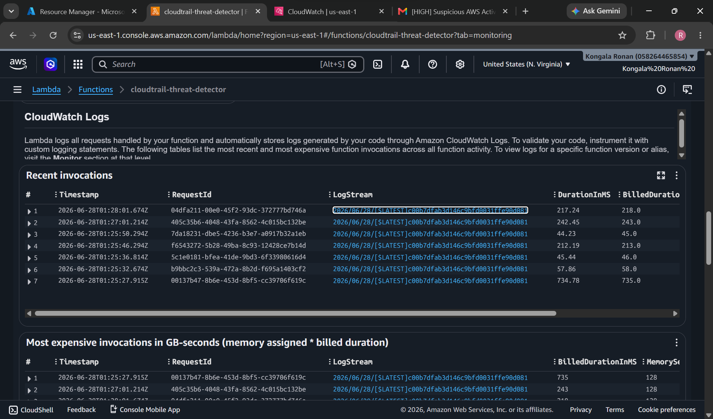

### 11. CloudWatch Log Events
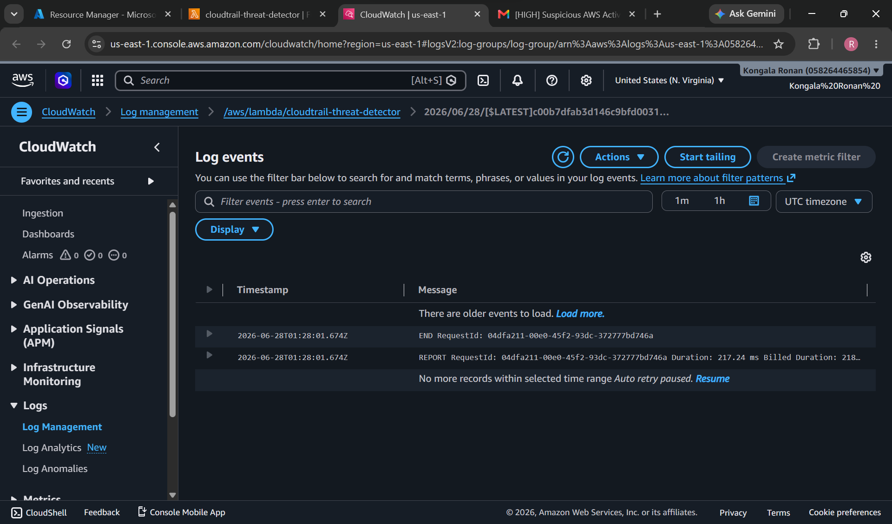

---

## Alert Schema

Each alert is sent via SNS email and logged to DynamoDB in the following format:

```json
{
  "severity": "HIGH",
  "event": "CreateUser",
  "user": "arn:aws:iam::058264465854:root",
  "source_ip": "172.220.69.40",
  "region": "us-east-1",
  "time": "2026-06-28T01:24:27Z"
}
```

---

## Setup Instructions

### Prerequisites
- AWS account (free tier sufficient)
- AWS Console access

### Step 1: Enable CloudTrail
- Create a multi-region trail logging to an S3 bucket
- Enable management events (Read + Write)

### Step 2: Create IAM Role
- Create role `cloudtrail-detector-role` for Lambda
- Attach: `AmazonS3ReadOnlyAccess`, `AmazonSNSFullAccess`, `AmazonDynamoDBFullAccess`, `CloudWatchLogsFullAccess`

### Step 3: Create SNS Topic
- Create standard topic `cloudtrail-alerts`
- Add email subscription and confirm

### Step 4: Create DynamoDB Table
- Table name: `cloudtrail-alert-log`
- Partition key: `event_id` (String)

### Step 5: Deploy Lambda
- Runtime: Python 3.12
- Attach `cloudtrail-detector-role`
- Paste `lambda/detector.py` code
- Update `SNS_TOPIC_ARN` with your topic ARN
- Add S3 trigger on the CloudTrail log bucket

### Step 6: Test
Trigger detections by performing IAM actions (create user, attach policy) and verify:
- Email alert received via SNS
- Record written to DynamoDB
- Execution logged in CloudWatch

---

## Results

- 11 detection rules covering CRITICAL, HIGH, MEDIUM, and LOW severity events
- 6 Lambda invocations logged with 100% success rate and 0 errors
- Real-time email alerts confirmed working end to end
- Full audit trail persisted in DynamoDB

---

## Skills Demonstrated

- AWS serverless architecture (Lambda, S3, SNS, DynamoDB, CloudTrail)
- IAM least-privilege role design
- Security detection engineering with MITRE ATT&CK mapping
- Python security automation (boto3)
- Cloud threat detection and incident alerting
